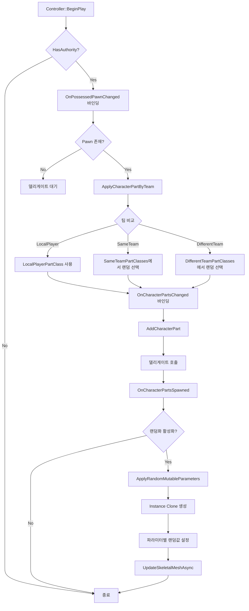

# UTestPlayControllerComponent_CharacterParts

팀 기반 캐릭터 파트 적용 및 Mutable 파라미터 랜덤화 기능을 제공하는 Controller Component입니다.

## 개요

이 컴포넌트는 `ULyraControllerComponent_CharacterParts`를 상속받아 다음 기능을 제공합니다:

- **팀 기반 파트 분류**: 로컬 플레이어 / 같은 팀 / 다른 팀에 따라 다른 캐릭터 파트 적용
- **랜덤 파트 선택**: 배열에서 랜덤하게 파트 클래스 선택
- **Mutable 파라미터 랜덤화**: 각 캐릭터마다 독립적인 외형 커스터마이징

---

## 설정 가이드

### 1. 기본 파트 클래스 설정

| 프로퍼티 | 설명 |
|----------|------|
| `LocalPlayerPartClass` | 로컬 플레이어에게 적용할 파트 액터 클래스 (필수) |
| `SameTeamPartClasses` | 같은 팀에게 적용할 파트 배열 (랜덤 선택) |
| `DifferentTeamPartClasses` | 다른 팀에게 적용할 파트 배열 (랜덤 선택) |

> **참고**: 배열이 비어있거나 유효하지 않으면 `LocalPlayerPartClass`가 Fallback으로 사용됩니다.

### 2. Mutable 랜덤화 옵션 (`FRandomPartOptions`)

각 파트 타입(LocalPlayer, SameTeam, DifferentTeam)별로 개별 설정 가능합니다.

| 프로퍼티 | 타입 | 설명 |
|----------|------|------|
| `bEnableRandomization` | bool | `true`: 랜덤화 활성화 |
| `WhitelistParameterNames` | TArray\<FString\> | 랜덤화할 파라미터 이름 목록 (비어있으면 전체 대상) |
| `ColorPalette` | TArray\<FLinearColor\> | Color 파라미터용 색상 팔레트 (비어있으면 완전 랜덤) |

---

## 설정 예시

### 블루프린트에서 설정

```
LocalPlayerPartClass: B_TestMetahumanLocal_C
SameTeamPartClasses: [B_TestMetahumanAlly1_C, B_TestMetahumanAlly2_C]
DifferentTeamPartClasses: [B_TestMetahumanEnemy1_C, B_TestMetahumanEnemy2_C]

LocalPlayerRandomOptions:
  bEnableRandomization: true
  WhitelistParameterNames: ["HairGroup", "ShirtGroup", "PantsGroup"]
  ColorPalette: []

DifferentTeamRandomOptions:
  bEnableRandomization: true
  WhitelistParameterNames: []  // 전체 파라미터 랜덤화
  ColorPalette: [Red, Blue, Green]  // 색상은 지정된 팔레트에서 선택
```

---

## 동작 흐름



---

## 주요 함수

| 함수 | 설명 |
|------|------|
| `ApplyCharacterPartByTeam()` | 팀 비교 후 적절한 파트 클래스 선택 및 추가 |
| `OnCharacterPartsSpawned()` | 파트 스폰 완료 후 Mutable 랜덤화 트리거 |
| `ApplyRandomMutableParameters()` | Instance Clone 생성 및 파라미터 랜덤화 적용 |
| `IsParameterInWhitelist()` | 화이트리스트 필터링 체크 |

---

## 주의사항

1. **CustomizableObject 컴파일 필수**
   - 파트 액터의 Mutable CO가 **사전 컴파일**되어 있어야 파라미터에 접근 가능
   - 에디터에서 CO 에셋을 열고 Compile → Save

2. **Instance Clone**
   - 각 액터마다 독립적인 `CustomizableObjectInstance`를 Clone하여 사용
   - 공유 Instance를 직접 수정하면 모든 캐릭터에 동일하게 적용됨

3. **GC 안전**
   - Clone된 Instance는 `SetCustomizableObjectInstance()`를 통해 UPROPERTY에 등록되어 GC 안전

4. **서버 전용**
   - `HasAuthority()` 체크로 서버에서만 파트 적용 로직 실행

---

## 파일 위치

- **Header**: `Public/GameMode/TestPlayControllerComponent_CharacterParts.h`
- **Source**: `Private/GameMode/TestPlayControllerComponent_CharacterParts.cpp`
- **Module**: `TestPlayRuntime`
